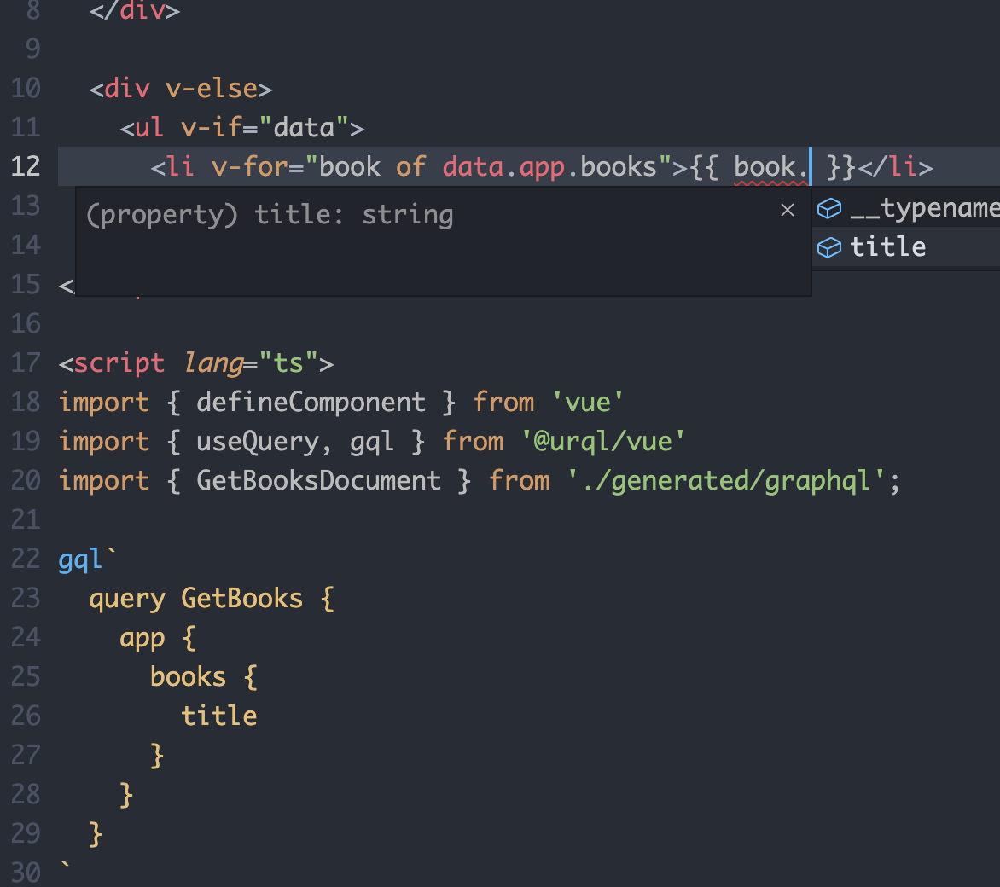
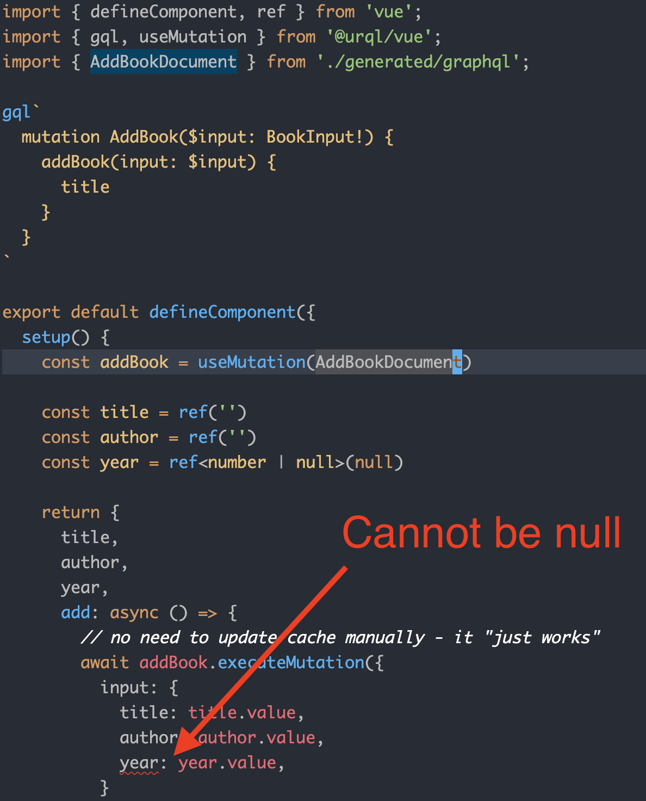

## Type Safe GraphQL with Vue 3

This is an article walking through constructing a stack to do type safe GraphQL with Vue 3. It uses:

- [graphql](https://graphql.org/) (graphql spec)
- [express-graphql](https://github.com/graphql/express-graphql) (express graphql middleware for the server)
- [urql](https://formidable.com/open-source/urql/) (and `@urql/vue`) for the front-end client
- [nexus-graphql](https://nexusjs.org/) library for generating GraphQL schema using TypeScript objects
- [nexus-decorators](https://github.com/graphql-nexus/nexus-decorators) experimental decorator syntax for use with `nexus-graphql`
- [graphql-code-generator](https://www.graphql-code-generator.com/) generate TypeScript types from `gql` queries

It's a lot of moving parts. We will create a non type safe app with Vue 3 and urql, then make it type safe starting from the back-end and work our way to the front-end.

## Getting Started

Create a new Vue 3 project with:

```sh
yarn create vite vue-urql-nexus --template vue-ts
```

## Create a GraphQL Server 

The first thing we need is a GraphQL server to test. Like every GraphQL tutorial, be prepared to install a LOT of dependencies. 

For now, we need these dependencies:

```sh
yarn add ts-node graphql express-graphql express cors @types/express @types/cors --dev
```

Now make `graphql/server.ts` and add some code:

```ts
import { graphqlHTTP } from "express-graphql";
import express from "express";
import { buildSchema } from "graphql";
import cors from "cors";

const graphqlSchema = buildSchema(`
  type Book {
    title: String!
    year: Int!
    author: String!
  }

  type App {
    books: [Book!]
  }

  type Query {
    app: App!
  }

  input BookInput {
    title: String!
    year: Int!
    author: String!
  }

  type Mutation {
    addBook(input: BookInput!): Book!
  }

`);

const app = express();

const context = {
  app: {
    books: [{ title: "Some title", year: 1980, author: "Lachlan" }],
  },
};

app.use(cors());
app.use(
  "/graphql",
  graphqlHTTP(() => {
    return {
      schema: graphqlSchema,
      graphiql: true,
      context,
      rootValue: {
        app: (_: any, ctx: typeof context) => {
          return ctx.app;
        },
        addBook: (
          args: { input: { title: string; year: number; author: string } },
          ctx: typeof context
        ) => {
          const book = args.input;
          ctx.app.books.push(book);
          return book;
        },
      },
    };
  })
);

app.listen(4000, () => {
  console.log("Started server on 4000");
});
```

Quite a bit going on here. We introduce `input`, `type`, `Query` and `Mutation`. We use a singleton to maintain state. Notice a problem - we have duplicate types, in the GraphQL schema and in the `addBook` function. Not ideal... two sources of truth. More on this later.

Grab the `tsonfig.json` from this repository, or configure it yourself, then start the server with `yarn ts-node graphql/server.ts`. You will need to restart every time you change it, or you could use `ts-node-dev`. Anyway, what this is doing is declaring a basic schema - I'll be storing all my data under `app`.

If you go to `http://localhost:4000` you can query it. You can also add a new book with a mutation:

```graphql
query Books {
  app {
    books {
      title
    }
  }
}

mutation AddBook($input: BookInput!) {
  addBook(input: $input) {
    title
  }
}

# variables
# {
#   "input": {
#     "title": "New title",
#     "year": 1990,
#     "author": "Lachlan"
#   }
# }
```


## Using urql with Vue

Add `@urql/vue`:

```sh
yarn add @urql/vue
```

Create a new client in `App.vue`. You should also create `Query.vue` and `Mutation.vue`.

```html
<template>
  <Query />
</template>

<script lang="ts">
import { defineComponent } from 'vue'
import { createClient, provideClient } from '@urql/vue'
import Query from './Query.vue'
import Mutation from './Mutation.vue'

const client = createClient({
  url: 'http://localhost:4000/graphql',
});

export default defineComponent({
  components: { Query, Mutation },
  setup() {
    provideClient(client);
  }
})
</script>
```

## Query with urql

Now let's query using urql. Add this to `Query.vue`:

```html
<template>
  <div v-if="fetching">
    Loading...
  </div>

  <div v-else-if="error">
    Oh no... {{ error }}
  </div>

  <div v-else>
    <ul v-if="data">
      <li v-for="book of data.app.books">{{ book.title }}</li>
    </ul>
  </div>
</template>

<script lang="ts">
import { defineComponent } from 'vue';
import { useQuery, gql } from '@urql/vue'

const GetBooks = gql`
  query GetBooks {
    app {
      books {
        title
      }
    }
  }
`

export default defineComponent({
  setup() {
    const result = useQuery({
      query: GetBooks
    });

    return {
      fetching: result.fetching,
      data: result.data,
      error: result.error,
    };
  }
})
</script>
```

Here's the main parts:

- Make a query with `gql`. I'm using the same one we tested in the browser with. 
- Use `useQuery` to launch the query. It returns a `reactive` object with some useful properties.
- Render the result.

Start Vite with `yarn dev` and head to the browser. You should see a single book title rendered.

## Reactive Mutations with urql

Let's add a mutation. Update `Mutation.vue`:

```html
<template>
  <div>
    <label for="book-title">Title:</label>
    <input id="book-title" v-model="title" />

    <label for="book-author">Author:</label>
    <input id="book-author" v-model="author" />

    <label for="book-year">Year:</label>
    <input id="book-year" v-model.number="year" />

    <button @click="add">Add Book</button>
  </div>
</template>

<script lang="ts">
import { defineComponent, ref } from 'vue';
import { gql, useMutation } from '@urql/vue';

const AddBook = gql`
  mutation AddBook($input: BookInput!) {
    addBook(input: $input) {
      title
    }
  }
`

export default defineComponent({
  setup() {
    const addBook = useMutation(AddBook)

    const title = ref('')
    const author = ref('')
    const year = ref<number | null>(null)

    return {
      title,
      author,
      year,
      add: async () => {
        // no need to update cache manually - it "just works"
        await addBook.executeMutation({ 
          input: { 
            title: title.value,
            author: author.value,
            year: year.value,
          } 
        })
        title.value = ''
        author.value = ''
        year.value =  null
      }
    }
  }
})
</script>
```

All the types in the `gql` must match up to the ones your declared in your schema.

Finally, the cool part - sumbit the form and you'll see the UI is automatically updated with the new book you created! The magic of urql and Vue.


## Solving the Typing Problem

So everything works, but it's not type safe. Getting this to be type safe is a mission, are you ready? We will use a combination of tools, each more complex than the last:our

- [graphql-code-generator](https://www.graphql-code-generator.com/). Creates types from your schema from `gql`. It extracts them from your `vue` files.
- [graphql-nexus](https://nexusjs.org/). Generate schema from types.
- [nexus-decorators](https://github.com/graphql-nexus/nexus-decorators). Works with graphql-nexus. Decorate classes which are turned into a schema.

If we set it up correctly, everything will be type safe and we will generate the correct schema from the definitions. As a reminder, the schema looks like this:

```graphql
type Book {
  title: String!
  year: Int!
  author: String!
}

type App {
  books: [Book!]
}

type Query {
  app: App!
}

input BookInput {
  title: String!
  year: Int!
  author: String!
}

type Mutation {
  addBook(input: BookInput!): Book!
}
```

## Creating a Schema with GraphQL Nexus

Add the dependencies:

```ts
yarn add nexus nexus-decorators --dev
```

Inside of `graphql/schema.ts` add the following:

```ts
import path from "path";
import { makeSchema } from "nexus";

export const graphqlSchema = makeSchema({
  types: [],
  shouldGenerateArtifacts: true,
  shouldExitAfterGenerateArtifacts: Boolean(process.env.GRAPHQL_CODEGEN),
  outputs: {
    typegen: path.join(__dirname, "gen/nxs.gen.ts"),
    schema: path.join(__dirname, "schema.graphql"),
  },
  contextType: {
    module: path.join(__dirname, "./Context.ts"),
    export: "Context",
  },
});
```

This will be how we create our schema and our types. The schema will be in `graphql/schema.graphql` and the types in `graphql/gen/nxs.gen.ts`.

Add a simple `Context` to `graphql/Context.ts`. This is how we will get type safety on the context variable.

```ts
export abstract class Context {
}
```

You can create the schema by running `ts-node graphql/schema.ts`. I'd recommend making a file: `graphql/build-schema.ts` and adding:

```ts
process.env.GRAPHQL_CODEGEN = "true";
import "./schema";
```

Better yet, make it a script in `package.json`:

```json
{
  "scripts": {
    "build-schema": "ts-node --transpile-only graphql/schema.ts"
  }
}
```

Now just run `yarn build-schema`. The `GRAPHQL_CODEGEN` will be useful later when starting the server.

The code generates two files. One is `graphql/schema.graphql`. It's simple:

```graphql
### This file was generated by Nexus Schema
### Do not make changes to this file directly


type Query {
  ok: Boolean!
}
```

Another is `graphql/gen/nxs.gen.ts` is more or less impossible to read - but take a look anyway.

## Adding Context, App and Book Entities

Let's add `Context`, `App` and `Book` types. They are defined in `graphql`. Start with `Context`:

```ts
// graphql/Context.ts
import { App } from "./App";
import { Book } from "./Book";

export abstract class Context {
  abstract books: Book[]
  app = new App(this)
}
```

Next, `Book`:

```ts
// graphql/Book.ts
import { nxs } from "nexus-decorators";

export interface BookDetails {
  title: string;
  author: string;
  year: number;
}

@nxs.objectType({
  description: "Represents a book",
})
export class Book {
  constructor(private details: BookDetails) {}

  @nxs.field.nonNull.string()
  get title() {
    return this.details.title;
  }

  @nxs.field.nonNull.string()
  get author() {
    return this.details.author;
  }

  @nxs.field.nonNull.int()
  get year() {
    return this.details.year;
  }
}

```

And finally, `App`:

```ts
// graphql/App.ts
import { nxs } from "nexus-decorators";
import { Book } from "./Book";
import { Context } from "./Context";

export class App {
  constructor(private ctx: Context) {}

  @nxs.field.nonNull.list.nonNull.type(() => Book, {
    description: "All books in the system",
  })
  get books() {
    return this.ctx.books
  }
}
```

We use `nxs` to decorate everything we'd like to expose via GraphQL - this will give us our GraphQL schema and TypeScript definitions.

Add the `Book` type in `schema.ts`:

```ts
import path from "path";
import { makeSchema } from "nexus";
import { Book } from "./Book";

export const graphqlSchema = makeSchema({
  types: [Book],
   
  // ...
});
```

Regenerate the schema: `yarn build-schema`.

```graphql
### This file was generated by Nexus Schema
### Do not make changes to this file directly


"""Represents a book"""
type Book {
  author: String!
  title: String!
  year: Int!
}

type Query {
  ok: Boolean!
}
```

Getting closer. It's worth seeing how `nxs.gen.ts` changed, too. Here are some of the more important ones:

```ts
export interface NexusGenFieldTypes {
  Book: { // field return type
    author: string; // String!
    title: string; // String!
    year: number; // Int!
  }
  Query: { // field return type
    ok: boolean; // Boolean!
  }
}

export interface NexusGenFieldTypeNames {
  Book: { // field return type name
    author: 'String'
    title: 'String'
    year: 'Int'
  }
  Query: { // field return type name
    ok: 'Boolean'
  }
}

// ...

export interface NexusGenTypes {
  context: Context;
}
```

## Adding a Query Entity

Add `graphql/Query.ts`:

```ts
import { nxs } from "nexus-decorators";
import { App } from "./App";
import { Book } from "./Book";
import { Context } from "./Context";
import { NexusGenTypes } from "./gen/nxs.gen"

@nxs.objectType({
  description: "root query",
})
export class Query {
  constructor(private ctx: Context) {}

  @nxs.field.nonNull.type(() => App)
  app(_: any, ctx: NexusGenTypes["context"]) {
    return ctx.app;
  }

  @nxs.field.nonNull.list.nonNull.type(() => Book)
  books(_: any, ctx: NexusGenTypes["context"]) {
    return ctx.app.books;
  }
}
```

Now re-generate the schema and see the generated `schema.grapql`:

```graphql
### This file was generated by Nexus Schema
### Do not make changes to this file directly


type App {
  """All books in the system"""
  books: [Book!]!
}

"""Represents a book"""
type Book {
  author: String!
  title: String!
  year: Int!
}

"""root query"""
type Query {
  app: App!
  books: [Book!]!
}
```

Great! We are almost back to our original schema. This is type safe, though - everything is written in TypeScript using classes and decorators.

Update `graphql/schema.ts` to include `Query`:

```ts
// ...
import { Book } from "./Book";
import { Query } from "./Query";

export const graphqlSchema = makeSchema({
  types: [Book, Query],
  // ...
})
```

Use the new `Context` object in `graphql/server.ts`. We don't need the `rootValue` resolver anymore - this is handled via the `Context` (not entirely clear how this works yet - need to find out).

```ts
import { graphqlHTTP } from "express-graphql";
import express from "express";
import cors from "cors";
import { graphqlSchema } from "./schema";
import { Context } from "./Context";
import { Book } from "./Book";

const app = express();

class ServerContext extends Context {
  books = [new Book({ title: "My book", author: "Lachlan", year: 1990 })];
}

const context = new ServerContext()

app.use(cors());
app.use(
  "/graphql",
  graphqlHTTP(() => {
    return {
      schema: graphqlSchema,
      graphiql: true,
      context,
    };
  })
);

app.listen(4000, () => {
  console.log("Started server on 4000");
});
```

Start the server and test it out. The Vue app should be loading the books. The mutation won't work yet - let's define that now.

## Mutations with GraphQL Nexus

Add `graphql/Mutation.ts`:

```ts
import { inputObjectType, mutationType, nonNull } from "nexus";

export const Mutation = mutationType({
  definition (t) {
    t.field('addBook', {
      type: 'Book',
      description: "Add a book",
      args: { 
        input: nonNull(inputObjectType({
          name: 'BookInput',
          definition (t) {
            t.nonNull.string('title')
            t.nonNull.string('author')
            t.nonNull.int('year')
          }
        }))
      },
      async resolve (root, args, ctx) {
        return ctx.app.addBook(args.input)
      }
    })
  }
})
```

This one is not using `nexus-decorators`. There's probably some way to do it with that, but I don't know it, so I am using the original `nexus` object syntax.

Update `graphql/App.ts` to define the `addBook` method:

```ts
import { nxs } from "nexus-decorators";
import { Book, BookDetails } from "./Book";
import { Context } from "./Context";

export class App {
  constructor(private ctx: Context) {}

  @nxs.field.nonNull.list.nonNull.type(() => Book, {
    description: "All books in the system",
  })
  get books() {
    return this.ctx.books
  }

  addBook (details: BookDetails) {
    const book = new Book(details)
    this.ctx.books.push(book)
    return book
  }
}
```

Update the schema:

```ts
// ...
import { Query } from "./Query";
import { Mutation } from "./Mutation";

export const graphqlSchema = makeSchema({
  types: [Book, Query, Mutation],
  // ...
})
```

Re-generate with `yarn build-schemas`. Now we have our `BookInput` and `Mutation` again!

```ts
### This file was generated by Nexus Schema
### Do not make changes to this file directly


type App {
  """All books in the system"""
  books: [Book!]!
}

"""Represents a book"""
type Book {
  author: String!
  title: String!
  year: Int!
}

input BookInput {
  author: String!
  title: String!
  year: Int!
}

type Mutation {
  """Add a book"""
  addBook(input: BookInput!): Book
}

"""root query"""
type Query {
  app: App!
  books: [Book!]!
}
```

Now the app is working again, as expected!

## Type Safe Front-End

The back-end is type safe - but the front-end is not. We can do something about that using [`graphql-code-generator`](https://www.graphql-code-generator.com/).

Add a bunch of dependencies to `package.json` and install:

```json
{
  "devDependencies": {
    "@graphql-codegen/add": "^2.0.2",
    "@graphql-codegen/cli": "^1.21.6",
    "@graphql-codegen/typed-document-node": "^1.18.9",
    "@graphql-codegen/typescript": "^1.22.4",
    "@graphql-codegen/typescript-operations": "^1.18.3",
    "@graphql-typed-document-node/core": "^3.1.0"
  }
}
```

GraphQL Code Generator will extract the queries from `gql` tags and create TypeScript definitions. Let's configure it. Add the following to `graphql-codegen.yml`

```yml
overwrite: true
schema: './graphql/schema.graphql'
documents: 'src/**/*.vue'
generates:
  src/generated/graphql.ts:
    config:
      immutableTypes: true
      useTypeImports: true
      preResolveTypes: true
      onlyOperationTypes: true
      avoidOptionals: true
      enumsAsTypes: true
    plugins:
      - add:
          content: '/* eslint-disable */'
      - 'typescript'
      - 'typescript-operations'
      - 'typed-document-node'
```

Also add a script:

```json
{
  "scripts": {
    "codegen": "graphql-codegen --config ${PWD}/graphql-codegen.yml",
  }
}
```

Try running `yarn codegen`. The output is kind of readable:

```ts
/* eslint-disable */
import type { TypedDocumentNode as DocumentNode } from '@graphql-typed-document-node/core';
export type Maybe<T> = T | null;
export type Exact<T extends { [key: string]: unknown }> = { [K in keyof T]: T[K] };
export type MakeOptional<T, K extends keyof T> = Omit<T, K> & { [SubKey in K]?: Maybe<T[SubKey]> };
export type MakeMaybe<T, K extends keyof T> = Omit<T, K> & { [SubKey in K]: Maybe<T[SubKey]> };
/** All built-in and custom scalars, mapped to their actual values */
export type Scalars = {
  ID: string;
  String: string;
  Boolean: boolean;
  Int: number;
  Float: number;
};


export type BookInput = {
  readonly author: Scalars['String'];
  readonly title: Scalars['String'];
  readonly year: Scalars['Int'];
};


export type AddBookMutationVariables = Exact<{
  input: BookInput;
}>;


export type AddBookMutation = { readonly __typename?: 'Mutation', readonly addBook: Maybe<{ readonly __typename?: 'Book', readonly title: string }> };

export type GetBooksQueryVariables = Exact<{ [key: string]: never; }>;


export type GetBooksQuery = { readonly __typename?: 'Query', readonly app: { readonly __typename?: 'App', readonly books: ReadonlyArray<{ readonly __typename?: 'Book', readonly title: string }> } };


export const AddBookDocument = {"kind":"Document","definitions":[{"kind":"OperationDefinition","operation":"mutation","name":{"kind":"Name","value":"AddBook"},"variableDefinitions":[{"kind":"VariableDefinition","variable":{"kind":"Variable","name":{"kind":"Name","value":"input"}},"type":{"kind":"NonNullType","type":{"kind":"NamedType","name":{"kind":"Name","value":"BookInput"}}}}],"selectionSet":{"kind":"SelectionSet","selections":[{"kind":"Field","name":{"kind":"Name","value":"addBook"},"arguments":[{"kind":"Argument","name":{"kind":"Name","value":"input"},"value":{"kind":"Variable","name":{"kind":"Name","value":"input"}}}],"selectionSet":{"kind":"SelectionSet","selections":[{"kind":"Field","name":{"kind":"Name","value":"title"}}]}}]}}]} as unknown as DocumentNode<AddBookMutation, AddBookMutationVariables>;
export const GetBooksDocument = {"kind":"Document","definitions":[{"kind":"OperationDefinition","operation":"query","name":{"kind":"Name","value":"GetBooks"},"selectionSet":{"kind":"SelectionSet","selections":[{"kind":"Field","name":{"kind":"Name","value":"app"},"selectionSet":{"kind":"SelectionSet","selections":[{"kind":"Field","name":{"kind":"Name","value":"books"},"selectionSet":{"kind":"SelectionSet","selections":[{"kind":"Field","name":{"kind":"Name","value":"title"}}]}}]}}]}}]} as unknown as DocumentNode<GetBooksQuery, GetBooksQueryVariables>;
```

Let's try it out. We will use these instead of inlining the queries as strings. Update `Query.vue`:

```html
<script lang="ts">
import { defineComponent } from 'vue'
import { useQuery, gql } from '@urql/vue'
// This was generated by yarn codegen
import { GetBooksDocument } from './generated/graphql';

gql`
  query GetBooks {
    app {
      books {
        title
      }
    }
  }
`

export default defineComponent({
  setup() {
    const result = useQuery({
      query: GetBooksDocument // use the generated GetBooksDocument
    });

    return {
      fetching: result.fetching,
      data: result.data,
      error: result.error,
    };
  }
})
</script>
```

The `GetBooksDocument` was generated by GraphQL Code Generator, derived from `GetBooks` (which we no longer need to assign - just doing `gql` and naming the query is enough). We now have type completion.



Update `Mutation.vue` too - we can even get type safety around the inputs to mutations! We are already getting some value - `year` cannot be null, and this is reflected correctly:



Everything works again - but it's now type safe by default.

## Conclusion and Improvements

We are generating a lot of code. Consider running both the schema generation and front-end code generation in watch mode, using something like `concurrently`. Then you can get the latest types as soon as you save.

Some improvements would be exploring how to make more complex queries, use fragements, etc. I'm excited to continue learning about GraphQL and how to use it with urql.
